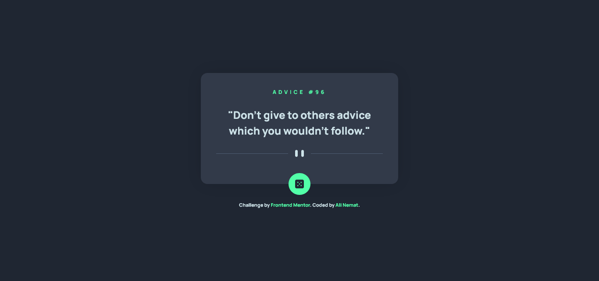

# Frontend Mentor - Advice generator app solution

This is a solution to the [Advice generator app challenge on Frontend Mentor](https://www.frontendmentor.io/challenges/advice-generator-app-QdUG-13db). Frontend Mentor challenges help you improve your coding skills by building realistic projects.

## Table of contents

- [Overview](#overview)
  - [The challenge](#the-challenge)
  - [Screenshot](#screenshot)
  - [Links](#links)
- [My process](#my-process)
  - [Built with](#built-with)
  - [Continued development](#continued-development)
- [Author](#author)

## Overview

### The challenge

Users should be able to:

- View the optimal layout for the app depending on their device's screen size
- See hover states for all interactive elements on the page
- Generate a new piece of advice by clicking the dice icon

### Screenshot

### Links

- Live Site URL: [Check it Online (Click!)](https://alinematt.github.io/Advice-generator-app)

## My process

### Built with

- Semantic HTML5 markup
- CSS custom properties
- Flexbox
- Vanilla JS

### Continued development

in future projects, I'm going to focus on optimize usage of HTML/CSS & write a better code! furthermore I'll try to find better & faster algorithems in JavaScript!

## Author

- Website - [Ali Nemat](https://www.alinemat.ir)
- Frontend Mentor - [@AliNematt](https://www.frontendmentor.io/profile/AliNematt)
- Instagram - [@alinemat.ir](https://www.instagram.com/alinemat.ir)
